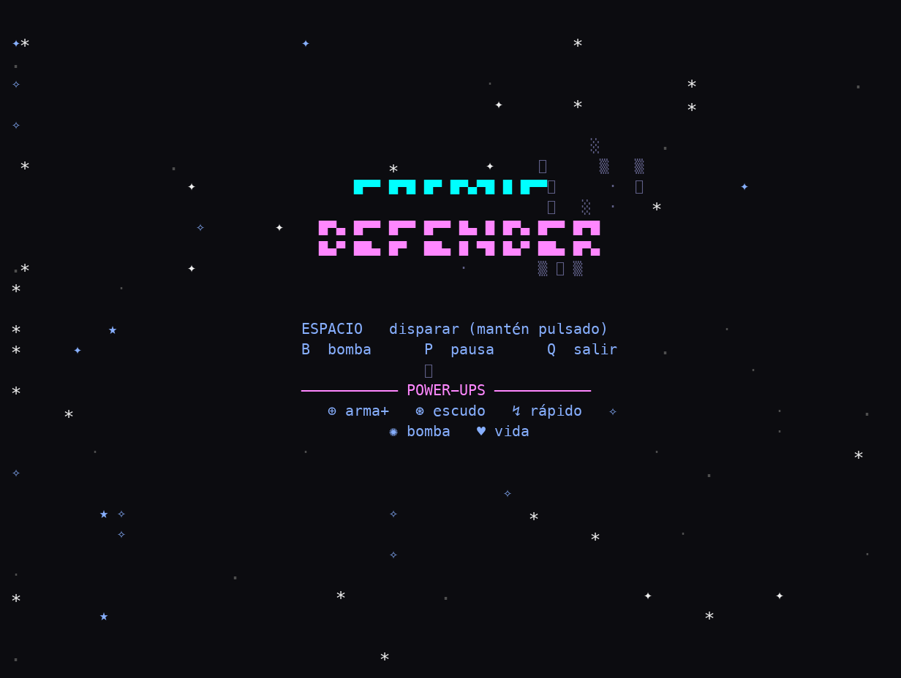
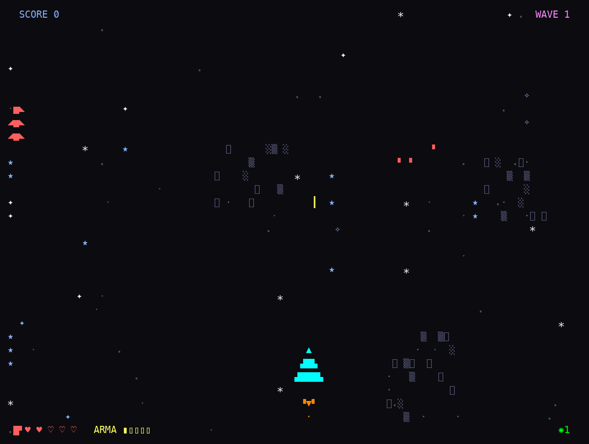

<div align="center">



# 🚀 Cosmic Defender

**Un shoot'em up espacial para la terminal con física de inercia, fuego con gradiente real, oleadas de enemigos y jefes.**


</div>

---

## Qué es esto

**Cosmic Defender** es un *shmup* (shoot'em up) vertical que corre enteramente en la terminal. Pilotas una nave con **física de inercia** —acelera y derrapa en lugar de moverse a saltos— a través de oleadas de enemigos cada vez más duras, esquivando kamikazes que se lanzan en picado y enfrentándote a jefes con núcleo destructible. Todo se dibuja en ASCII a todo color, con disparos y explosiones que pasan por un **gradiente de fuego** real (blanco → amarillo → naranja → rojo → humo) sobre un campo de estrellas con parallax.

## 🎮 Cómo se juega

| Tecla | Acción |
|-------|--------|
| **Flechas** / `W` `A` `S` `D` | Mover la nave (con inercia) |
| **Espacio** | Disparar (mantén pulsado para fuego continuo) |
| **`B`** | Lanzar bomba |
| **`P`** | Pausa |
| **`R`** | Reiniciar (en pantalla de game over) |
| **`Q`** / `Esc` | Salir |

Recoge power-ups para mejorar: **⊕** arma, **⊛** escudo, **↯** disparo rápido, **✺** bomba y **♥** vida.

## 🚀 Cómo ejecutar

```bash
python3 space_battle.py
```

> Requiere **Python 3** y una terminal compatible con `curses` (mínimo 50x20). Recomendado soporte de 256 colores; hay *fallback* a 8 colores. Sin dependencias externas. Pulsa **Espacio** en el título para comenzar.

## 📸 Captura

<div align="center">



</div>

## 🛠️ Bajo el capó

- **Python 3** con la librería estándar **`curses`**, sin dependencias externas.
- **Física de inercia** para el movimiento de la nave (velocidad/aceleración en lugar de pasos discretos).
- **Sistema de partículas y gradientes** de color propios: disparos, explosiones y estelas con degradado de fuego.
- **Campo de estrellas con parallax** (capas de estrellas lejanas, cercanas y azules) y nebulosas de fondo.
- **Oleadas de enemigos** variados (tanques/élites, kamikazes en picado) y **jefes** con núcleo destructible.
- **Power-ups, escudos, combos y curaciones**, con paleta rica de 256 colores y *fallback* a 8.

## 📦 Créditos

Creado por [@gavilanbe](https://github.com/gavilanbe) — más acción arcade dentro de su colección de juegos de terminal. 🕹️

## 📄 Licencia

Distribuido bajo la licencia [MIT](LICENSE).
